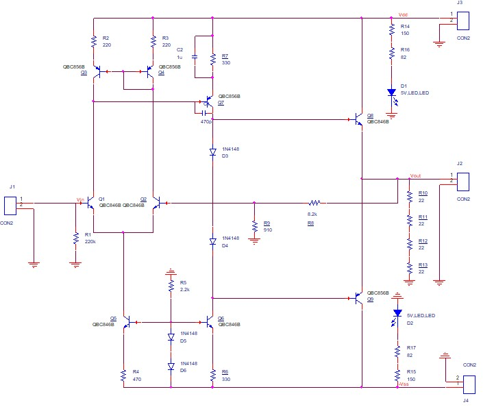
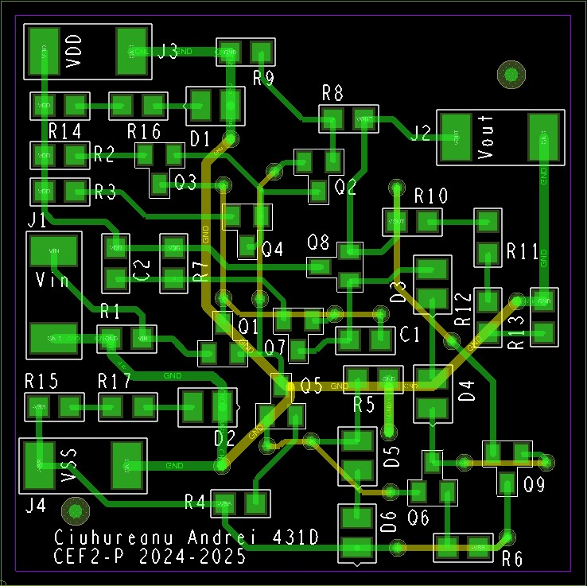

# Proiect Amplificator de Joasă Frecvență

## Descriere
Proiectul constă în proiectarea și realizarea practică a unui amplificator de tensiune de joasă frecvență, destinat amplificării unui semnal audio în condiții specifice definite prin parametri tehnici preciși (rezistențe de intrare și ieșire, amplificare în tensiune, încărcare, temperatură de operare).

## Date de proiectare
- Semnal de intrare: 540 mV
- Rezistența sarcină ieșire (RL): 90 Ω
- Rezistență intrare (Ri): >150 kΩ
- Rezistență ieșire (Ro): <0,9 Ω
- Amplificare în tensiune (Av): 10
- Domeniu temperatură operare: 0° - 70°C
- Semnalizare alimentare prin LED
- PCB: 40mm x 40mm, FR4 dublu strat, grosime cupru 18μm

## Structură și etaje amplificator
- **Etaj diferențial de intrare**: amplifică diferența semnalelor și utilizează o oglindă de curent pentru stabilizare și îmbunătățirea amplificării modului diferențial.
- **Etaj amplificare în configurație emitor comun**: oferă câștig ridicat și contribuie la stabilitatea circuitului.
- **Etaj ieșire clasă AB (push-pull)**: minimizează distorsiunile și asigură impedanță redusă de ieșire.
- **Rețea reacție negativă**: controlează amplificarea și stabilizează circuitul printr-un divizor rezistiv.

## Tehnologii utilizate
- OrCAD(Capture CIS, PCB Editor) (schema electrică și layout PCB)

## Schema electrică
Schema electrică detaliază conexiunile și componentele utilizate, ilustrând clar fiecare etaj al amplificatorului și rețeaua de reacție negativă.

## Layout PCB
Layout-ul PCB a fost proiectat cu trasee dimensionate corespunzător pentru curenții vehiculați, urmând schema electrică pentru o amplasare logică și eficientă a componentelor.

## Concluzie
Proiectul amplificatorului respectă cerințele impuse și oferă o bază solidă pentru analiza și îmbunătățirea performanțelor în etape viitoare, incluzând testări suplimentare și depanări în funcție de rezultatele experimentale.

---

# Low Frequency Amplifier Project

## Description
This project involves the design and practical realization of a low-frequency voltage amplifier, intended for amplifying audio signals under specific technical parameters (input/output resistance, voltage gain, load, and operating temperature).

## Design Specifications
- Input signal: 540 mV
- Output load resistance (RL): 90 Ω
- Input resistance (Ri): >150 kΩ
- Output resistance (Ro): <0.9 Ω
- Voltage gain (Av): 10
- Operating temperature range: 0° - 70°C
- LED indication for power supply
- PCB: 40mm x 40mm, double-layer FR4, copper thickness 18μm

## Amplifier Structure and Stages
- **Differential input stage**: amplifies signal differences and uses a current mirror for stability and improved differential mode amplification.
- **Common emitter amplification stage**: provides high voltage gain and contributes to overall circuit stability.
- **Class AB output stage (push-pull)**: minimizes distortion and ensures low output impedance.
- **Negative feedback network**: controls amplification and stabilizes the circuit through a resistive divider.

## Technologies Used
- OrCAD(Capture CIS, PCB Editor) (schematic and PCB layout)

## Electrical Schematic
The electrical schematic details the connections and components clearly illustrating each amplifier stage and the negative feedback network.

## PCB Layout
The PCB layout was designed with appropriate track widths based on current requirements, following the schematic for logical and efficient component placement.

## Conclusion
The amplifier project meets the specified requirements and provides a robust foundation for future performance analysis and enhancements, including further testing and troubleshooting based on experimental results.

